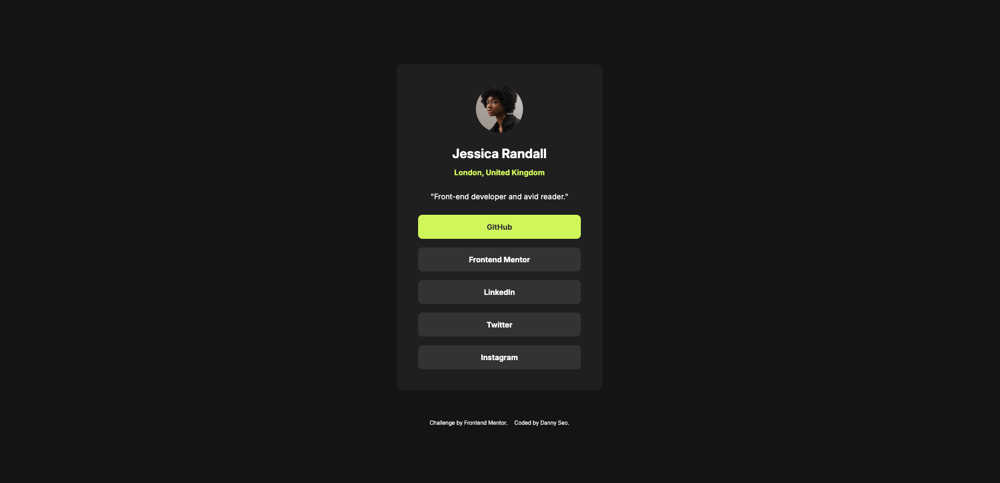

# Social_links_profile
 
This is a solution to the [Social links profile challenge on Frontend Mentor](https://www.frontendmentor.io/challenges/social-links-profile-UG32l9m6dQ). Frontend Mentor challenges help you improve your coding skills by building realistic projects. 

## Table of contents

- [Overview](#overview)
  - [Screenshot](#screenshot)
  - [Links](#links)
- [My process](#my-process)
  - [Built with](#built-with)
- [Author](#author)

## Overview

### Screenshot

### Links

- Solution URL: [Solution URL](https://github.com/kisu-seo/Social_links_profile)
- Live Site URL: [Live URL](https://kisu-seo.github.io/Social_links_profile/)

## My process

### Built with

- Semantic HTML5 markup
- CSS custom properties
- Mobile-first workflow

## Author

- Website - [Danny Seo](https://github.com/kisu-seo)
- Frontend Mentor - [@kisu-seo](https://www.frontendmentor.io/profile/kisu-seo)